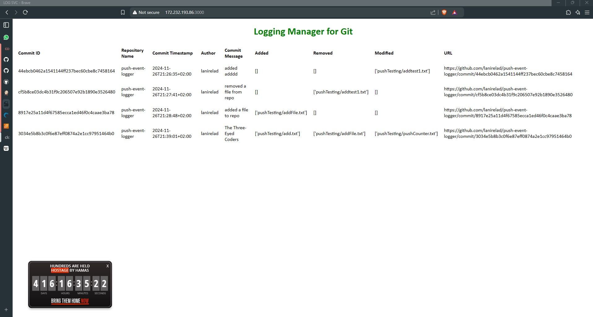

# GitHub Push Event Logging Service

This project is a logging service for GitHub push events. It receives GitHub webhook payloads, processes them, saves the data, and displays a log of commits in a user-friendly table.

## Features

- Handles incoming GitHub webhooks via the `/webhook` endpoint.
- Saves and logs webhook data to a JSON file (`webhook_data.json`).
- Displays a sorted list of commits in a table on the main page (`/`).
- Provides additional routes to view raw payload data (`/payload`) and log data (`/log`).

---

## Getting Started

The infrastructure repository automates the setup of all dependencies, including:

- **Docker**: For running the app in a container.
- **Docker Compose**: For orchestrating the deployment of services.
- **Terraform**: For provisioning and configuring cloud infrastructure.
- **Ansible**: For managing configuration and app deployment on the cloud instance.

These tools will be automatically installed and configured as part of the Jenkins pipeline, so you **do not need to manually install them**.


    **Note**: The infrastructure repository manages everything related to the app, from configuring cloud instances to running Docker Compose and setting up webhooks for GitHub. The app in this repository is designed to run as part of this setup and should not be run independently.

Follow the instructions in the [EventLoggerInfrastructure README](https://github.com/lanirelad/EventLoggerInfrastructure.git) to:

   - Configure the infrastructure on your cloud provider (e.g., set up a cloud instance).
   - Set up the required environment for the app to run, including Docker Compose.
   - Configure the GitHub webhook to point to the appropriate endpoint on your deployed app.

---

## Routes

### Main Page (`/`)

Displays a table of sorted commit logs with the following columns:

- **Commit ID**: Unique identifier for each commit.
- **Repository Name**: The repository where the commit was made.
- **Commit Timestamp**: The timestamp of the commit.
- **Author**: The commit author’s name.
- **Commit Message**: The message associated with the commit.
- **Added**: List of added files.
- **Removed**: List of removed files.
- **Modified**: List of modified files.
- **URL**: URL to the commit.

---

### Webhook Endpoint (`/webhook`)

Handles incoming `POST` requests with GitHub webhook data. The data is processed and saved to `webhook_data.json`.

---

### Payload Route (`/payload`)

Displays the raw webhook payload data.

---

### Log Route (`/log`)

Displays the contents of `webhook_data.json` in raw text format.

---

## File Structure

```plaintext
.
├── main.py                # Entry point for the Flask application
├── routes.py              # Defines application routes and logic
├── utils.py               # Utility functions for saving/reading webhook data
├── templates/
│   └── main.html          # HTML template for the main page
├── static/
│   ├── logSvc.css         # Optional CSS file for styling
│   ├── logFile.png        # Favicon for the app
├── requirements.txt       # Python dependencies
└── Dockerfile             # Dockerfile for containerizing the app
```

* * *

Outcome
------------------
